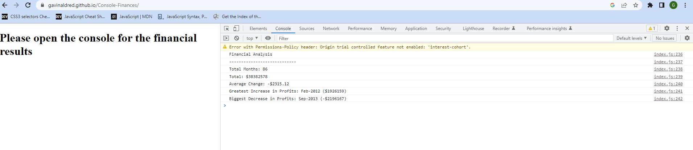

# Console-Finances
## Description

This work analyzes the financial records of a company. The console logs: 

* The total number of months included in the dataset.
* The net total amount of Profit/Losses over the entire period.

* The average of the **changes** in Profit/Losses over the entire period.

* The greatest increase in profits (date and amount) over the entire period.

* The greatest decrease in losses (date and amount) over the entire period.

## Installation

N/A

## Usage

View the completed project below on the deployed link. A screenshot has also been added.

 
  

   

[Link to the finished deployed website](https://gavinaldred.github.io/Console-Finances/)

## Credits

N/A

## License

Please refer to the LICENSE in the repo.

---

## Badges
